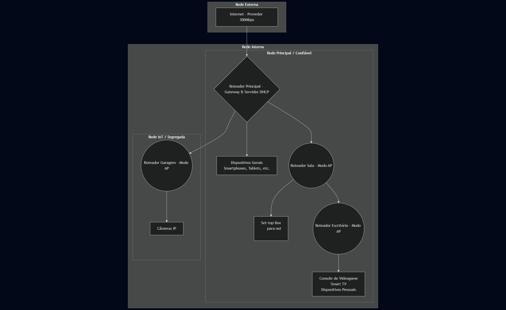

# Implementação de Rede Residencial Segmentada para Otimização de Cobertura e Segurança

Este repositório documenta o projeto prático de reestruturação de uma rede Wi-Fi residencial para solucionar problemas de cobertura e aumentar a segurança através da segmentação de redes.

## Diagrama da Rede

---

### 1. O Problema
A rede residencial, atendida por um plano de 300 Mbps, sofria com cobertura de sinal Wi-Fi deficiente e instável em diversos cômodos. A aquisição de uma solução Mesh era inviável devido ao alto custo.

### 2. A Solução Proposta
Foi implementada uma topologia de rede em cascata, reaproveitando roteadores existentes para expandir a cobertura do sinal. A estratégia centralizou a gestão de IPs no roteador principal e converteu os demais em Access Points (APs).

### 3. Implementação Técnica
* **Cascateamento e Configuração de APs:** O roteador principal foi mantido como o gateway da rede e o único servidor DHCP ativo. Nos roteadores secundários, o serviço DHCP foi desabilitado e eles foram configurados para operar em modo Access Point.
* **Segmentação de Rede para Segurança (IoT):** Para mitigar riscos, foi criada uma rede Wi-Fi segregada e dedicada exclusivamente a dispositivos de Internet das Coisas (IoT), como câmeras IP.

### 4. Resultados e Benefícios
* **Cobertura Total:** Eliminação completa das "zonas cegas" de sinal.
* **Otimização de Performance:** Máximo aproveitamento da velocidade contratada.
* **Segurança Reforçada:** Aumento da segurança através do isolamento de dispositivos IoT.
* **Baixo Custo:** Solução implementada com custo zero, reaproveitando equipamentos.

### 5. Tecnologias e Conceitos Aplicados
* Configuração de Roteadores
* Segurança de Rede
* DHCP e Endereçamento IP
* Segmentação de Rede (WLAN)
* Topologia de Rede
* Segurança de IoT
* Resolução de problemas
